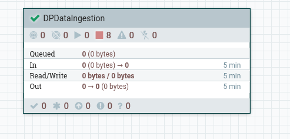
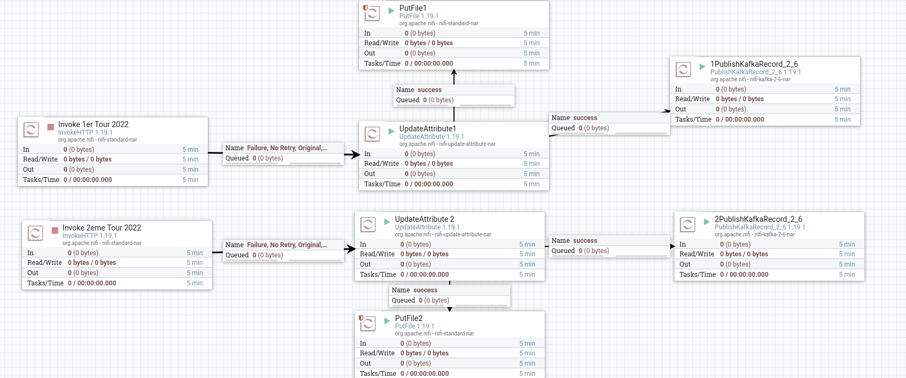
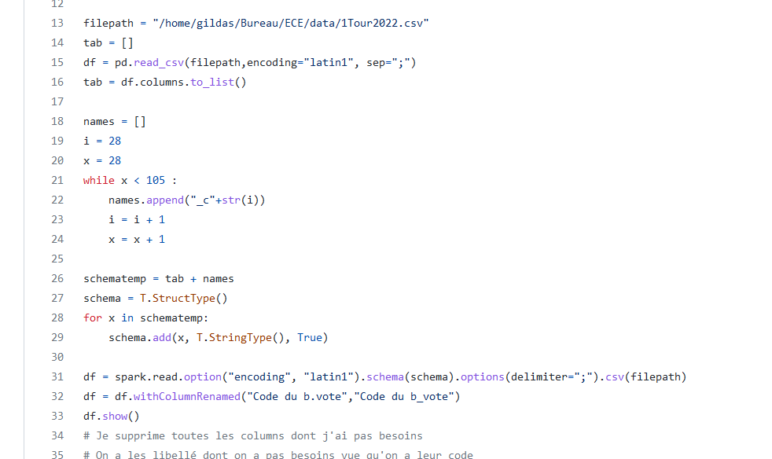
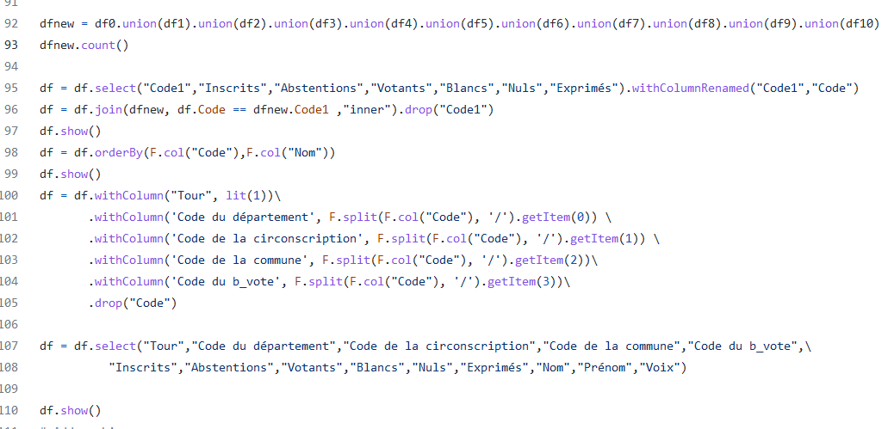
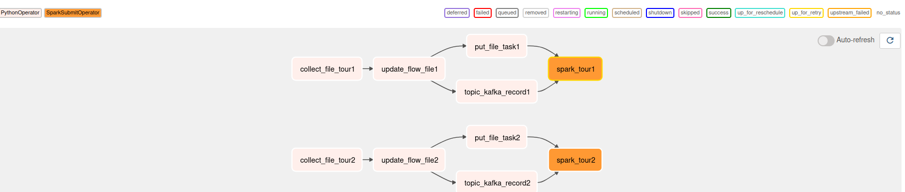
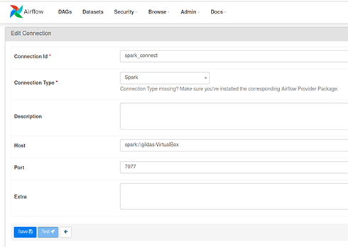
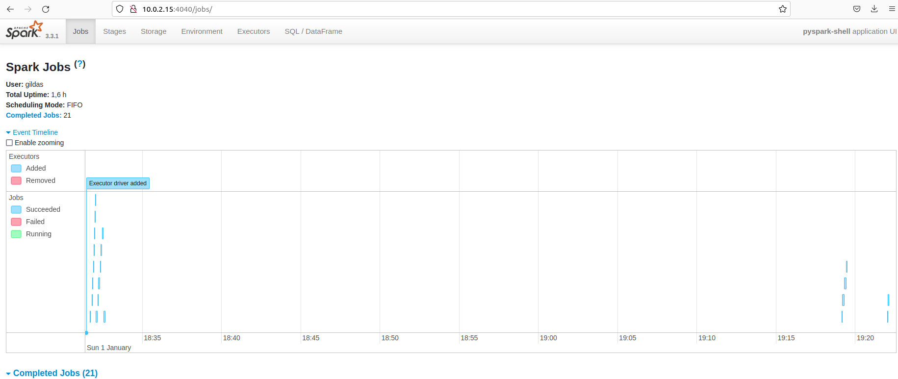

# Exam Pipeline election2022

# DATA COLLECT ( NIFI )
Objectif : Collecter les informations liées aux élection présidentielle des 10 et 24 avril 2022 - Résultats définitifs , les analyser et faire 
faire une transformations des données ( tour1 et tout2 ) afin de savoir les régions propices pour chaque candidat. Utiliser l'ensemble des technologies
appris en cours et préciser les outils externes pris en compte.

Démarches : 
On s'est référé au site data.gouv ( https://www.data.gouv.fr/fr/datasets/election-presidentielle-des-10-et-24-avril-2022-resultats-definitifs-du-1er-tour/ : pour le premier tour et https://www.data.gouv.fr/fr/datasets/election-presidentielle-des-10-et-24-avril-2022-resultats-definitifs-du-2nd-tour/ : pour le second tour) afin d'avoir des jeux de données exactes et plus fiables. 

#Collecte des données avec NIFI 

On a conçu un pipeline de données avec Nifi en partant d'un processor ( invoqueHTTP) qui sera chargé de récupéré le flux de données directement sur le site 
data.gouv. 

#Renommer le flux pour la sauvegarde en disque 
Afin de mieux traiter le flux de données , on a utilisé un processeur updateAttribute pour le renommer et le convertir directement en csv dans les propriétés.

#Ecriture en disque 
On a mis en place un processeur PutFile afin de sauvegarder notre jeu de données (ici 1tour2022.csv pour le 1er tour et 1tour2022.csv pour le second tour) et
de pouvoir le traiter dans spark. 

#Topic Kafka

Le processeur Kafka reçoit aussi le flux de données pour l'afficher sur sa console. 

# DATA TRANSFORM (SPARK)

Démarches : 
le but de cette partie est de transformer le fichier deu site data.gouv en un fichier plus structuré et plus facile à exploité

#Header :
D'abord on commence par lire le fichier avec le bon encodage "latin1" et le bon délimiteur ";". On remarque que le header du fichier est incomplet. Certaines colonnes n'ont pas d'header. On va donc leur crée un nom temporaire afin de pouvoir les manipuler. On va aussi donner des noms plus propices à certaines colonnes. 

#Manipulation :
On va déja supprimer toutes les colonnes qu'on juge inutiles. Par la suite on va changer la structure du dataframe. Le dataframe initial est bâti de façon à ce que sur chaque ligne, on a une "clé" (département, circonscription, commune, bureau de vote) unique avec tous les candidats et leurs voix. Ce qui entraine un dataframe avec plus de 100 colonnes ce qui n'est pas pratique.
On a préféré créer une colonne "code" ou on a concaténé (département, circonscription, commune, bureau de vote). Par là suite on crée plusieurs dataframes avec ce code, le prénom, le nom et le nombre de voix de chaque candidat. On "union" ces dataframes puis on join, grâce au "code", avec le dataframe initial en sélectionnant les colonnes qui nous intéressent. On obtient donc un dataframe qui a beaucoup plus de colonnes certes, mais ne dépasse pas les 20 colonnes.
Il nous reste à "Order By" ces colonnes pour mieux visualiser notre dataframe. on choisit donc de trier par ordre croissant en fonction d'abord du code et puis du nom des candidats.
Pour terminer on "split" ce qu'on a concaténé pour reavoir nos colonnes de base et puis on écrit le dataframe dans un nouveau fichier.

# GESTION DES TASKS (AIRFLOW)

On a utilisé AIRFLOW pour orchester nos tasks. Dans notre cas, les tasks se résument à lancer les processeurs nifi un par un, dans l'ordre ou en simultané. Une fois que les processeurs tous lancés et puis stoppés. On peut lancer la task qui lance le script spark.
Il suffit donc juste de mettre un trigger sur AIRFLOW et le processus est automatique de bout en bout. Le AIRFLOW met en marche les processeurs nifi qui importent les fichiers puis les scripts spark vont transformer ces derniers.   
On utilise cette architecture pour paralléliser notre travail en deux parties, le premier tour et le deuxième :

# INTEGRATION AIRFLOW - NIFI - SPARK

Pour intégrer airflow et spark ; on vas d'abord installer un provider dans airflow ( *apache-airflow-providers-apache-spark* ) et ensuite configurer la connection ( spark_connect).

Au final , on pourra lancer nos dags via airflow et celui-ci pourra demarrer chaque processeur nifi (integration grâce a notre nifi_api.py). 
Au dernier processeur (putfile ou publishtopickafka) , airflow pourra lancer un sparksubmitoperator afin de faire nos transformation.

Apres le lancement de notre dernier dag, on peut suivre les jobs sur l'interface spark master (demarrer au prealable le spark master). 

# CONCLUSION

Après transformation de nos jeux de données récupéré sur data.gouv , on peut savoir la repartitions des voix par candidat. On pourra ainsi voir les zones oû
tel candidat peut faire plus de campagnes. Les données en fin de format sont sous csv ( datatour1 pour le tour1 et datatour2 pour le tour2) nous donne les informations
par commune , par circonscription et par bureau de vote.

